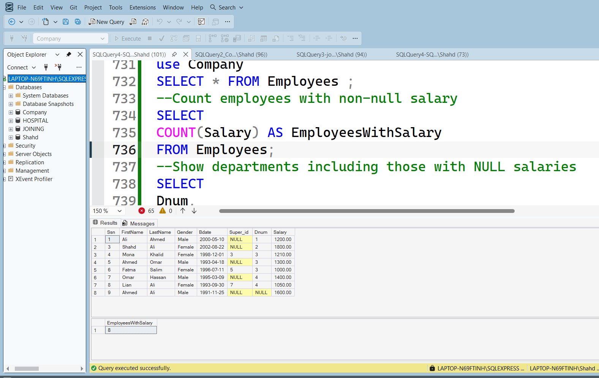

# SQL-Aggregate-Functions-Practice

This repository contains SQL Aggregate Functions practice tasks and solutions using Microsoft SQL Server.

The project focuses on practicing aggregation queries, grouping, filtering, and analytical SQL operations using sample databases and business scenarios.

---

## Topics Covered

- SUM()
- AVG()
- MAX()
- MIN()
- COUNT()
- GROUP BY
- HAVING
- ORDER BY
- Aggregate Functions with JOINs
- NULL Handling in Aggregation
- Multi-Level Aggregation
- Sales & Customer Analysis

---

## Practice Tasks Included

This practice includes multiple SQL aggregation challenges such as:

- Total and average salary calculations
- Department salary statistics
- Customer spending analysis
- Product sales summaries
- Revenue calculations
- Sales time analysis
- Customer loyalty analysis
- Aggregation with JOIN operations
- HAVING clause filtering
- NULL handling in aggregate functions

---

## Files

- `SQLQuery4-SQL Aggregate Functions.sql`
- `Aggregate Functions.pdf`

---

## Tools Used

- Microsoft SQL Server
- SQL Server Management Studio (SSMS)

---

## Preview

